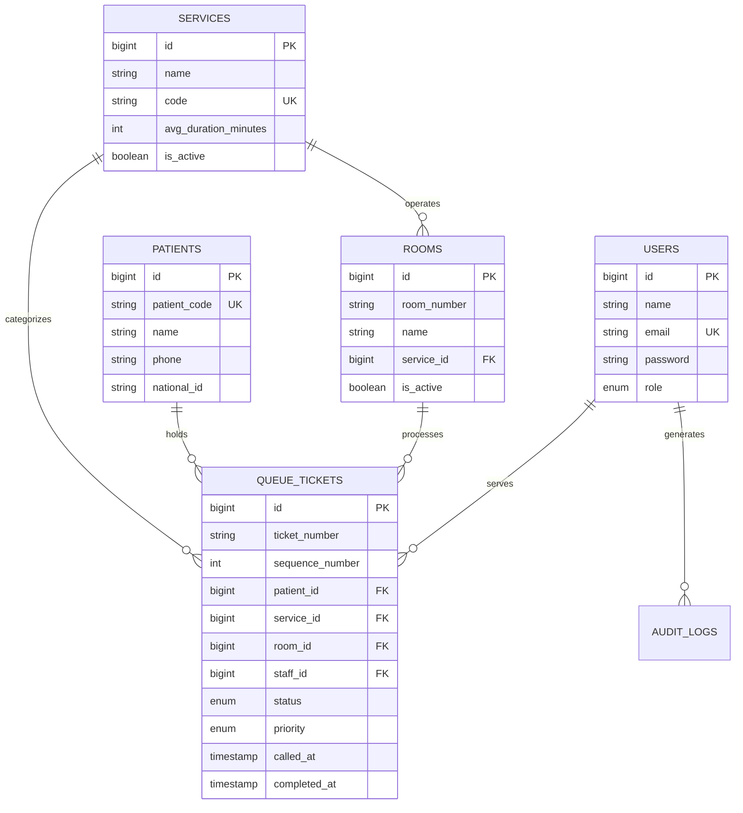
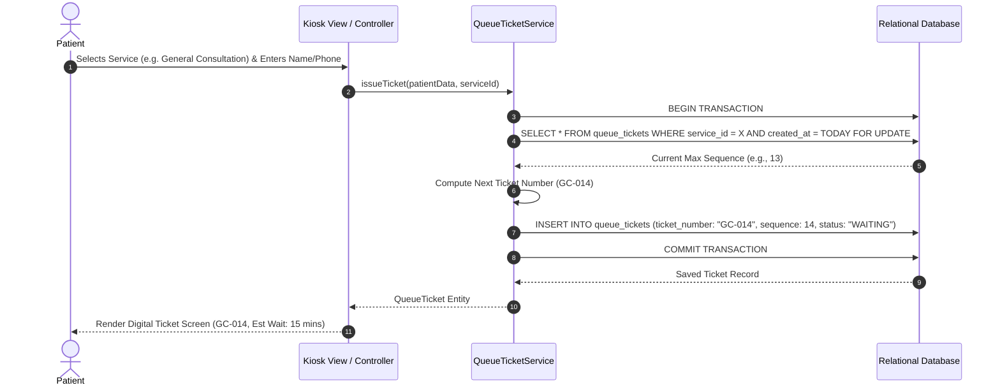
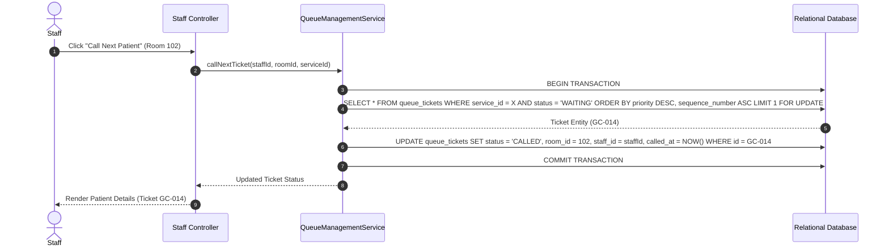

# System Design Skill Guide

Use this skill when designing architectural components, database schemas, sequence diagrams, and UI structures for **MediQueue**.

---

## 1. Mermaid Diagram Standards

All system design diagrams MUST be expressed in valid Mermaid markdown syntax to ensure readability in web browsers and repository previewers.

---

## 2. Mandatory Core System Diagrams

### Diagram 1: Context Diagram (Level 0 DFD)

```mermaid
graph TD
    Patient["Patient / Walk-In"] -->|Select Service & Register| System[("MediQueue System")]
    System -->|Issue Queue Ticket & Status| Patient
    
    Staff["Healthcare Staff / Doctor"] -->|Call Next / Update Status| System
    System -->|Display Patient Details & Queue| Staff
    
    Display["TV Waiting Room Display"] <--|Live Queue Poll / SSE| System
    
    Admin["System Administrator"] -->|Manage Services & Staff| System
```

---

### Diagram 2: Entity-Relationship Diagram (ERD)



---

### Diagram 3: Sequence Diagram (Atomic Ticket Generation)



---

### Diagram 4: Sequence Diagram (Staff Ticket Calling Flow)


