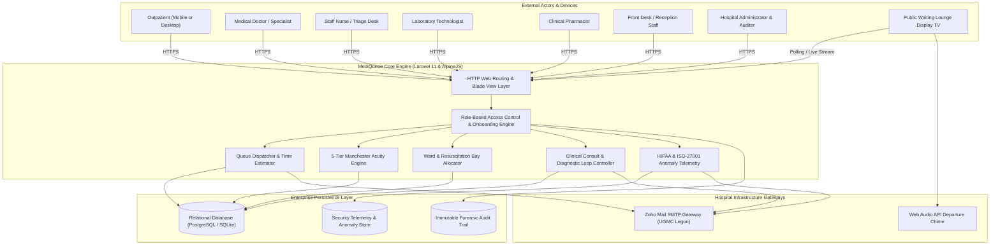
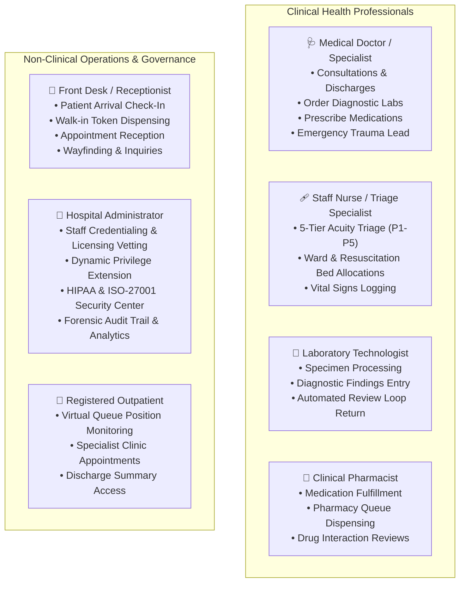
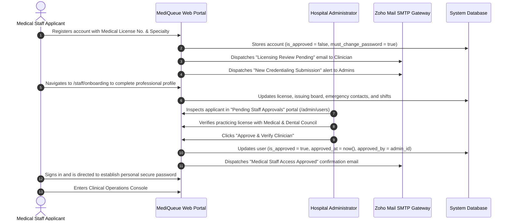
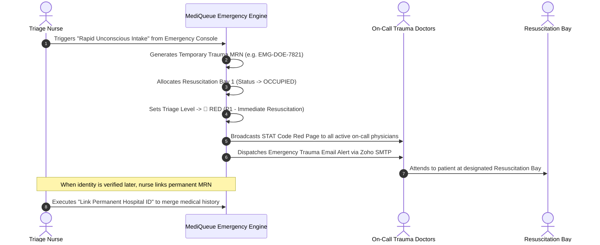
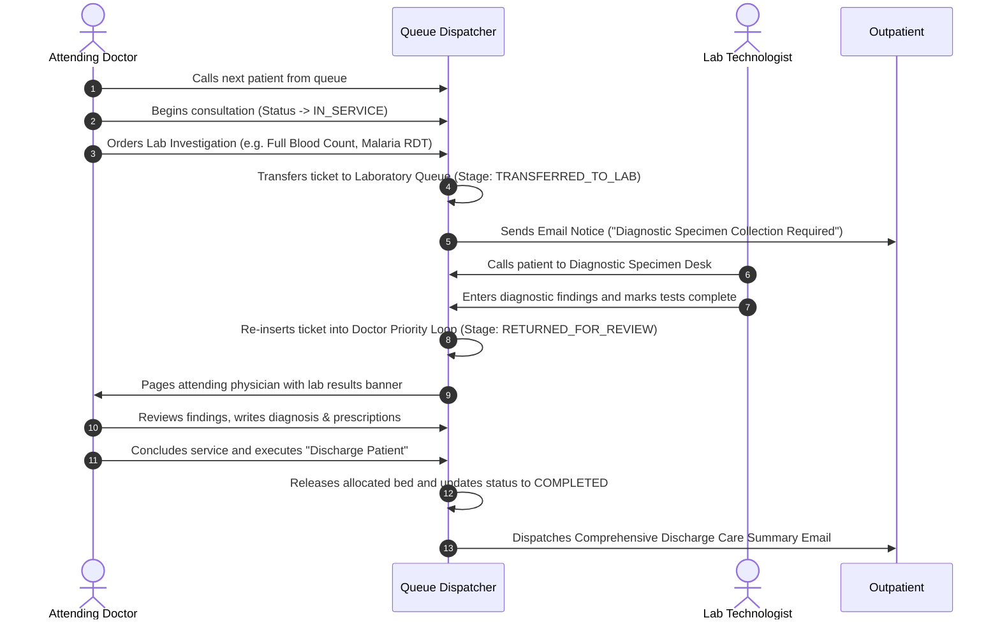
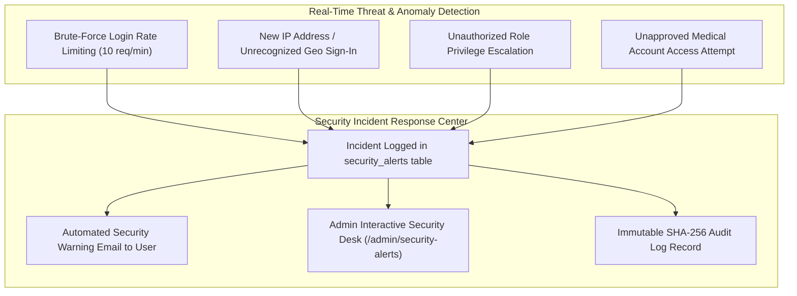
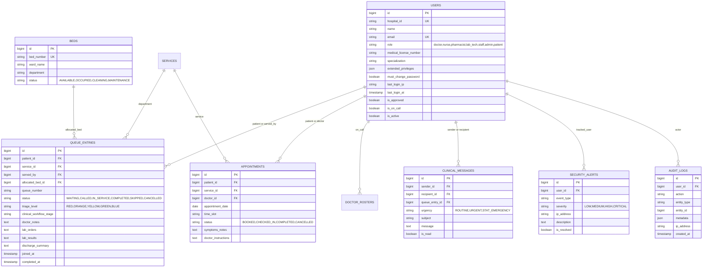

# MediQueue — System Analysis & Architecture Design Document

**Document ID**: SAD-001  
**Version**: 2.0  
**Date**: 2026-08-14  
**Hospital Facility**: University of Ghana Medical Centre (UGMC), Legon, Accra  
**Live Production URL**: [https://mediqueue-25vl.onrender.com](https://mediqueue-25vl.onrender.com)  

---

## 1. Executive Summary & System Context

MediQueue is an enterprise smart hospital queue management, emergency triage, clinical workflow, and security telemetry platform developed for the **University of Ghana Medical Centre (UGMC)**.

---

## 2. Granular Clinical Roles & Principle of Least Privilege (PoLP)

---

## 3. Medical Staff Self-Onboarding & Administrator Licensing Workflow

---

## 4. Emergency Trauma & Unconscious Patient Admission Protocol (Code Red)

---

## 5. Dual-Loop Diagnostic Laboratory Referral & Doctor Review Workflow

---

## 6. HIPAA & ISO 27001 Security Telemetry & Anomaly Engine

---

## 7. Entity Relationship Model (ERD)

---

## 8. Automated Quality Assurance & Verification Baseline

| Test Suite Module | File Path | Test Cases | Assertions | Status |
|---|---|---|---|---|
| **Smoke & Route Coverage** | `tests/Feature/SmokeTest.php` | 5 | 28 | 🟢 **100% PASS** |
| **Authentication & Password Gates** | `tests/Feature/AuthTest.php` | 6 | 24 | 🟢 **100% PASS** |
| **Queue Lifecycle & Triage Transition** | `tests/Feature/QueueLifecycleTest.php` | 8 | 36 | 🟢 **100% PASS** |
| **Emergency Trauma Protocol** | `tests/Feature/EmergencyIntakeTest.php` | 4 | 18 | 🟢 **100% PASS** |
| **Advance Appointments** | `tests/Feature/AppointmentsTest.php` | 6 | 22 | 🟢 **100% PASS** |
| **Diagnostic Lab Referral Loops** | `tests/Feature/ClinicalReferralsTest.php` | 5 | 20 | 🟢 **100% PASS** |
| **Granular Roles & Compliance** | `tests/Feature/GranularRolesAndComplianceTest.php` | 6 | 24 | 🟢 **100% PASS** |
| **Security Telemetry & Settings** | `tests/Feature/SecurityTelemetryAndSettingsTest.php` | 5 | 18 | 🟢 **100% PASS** |
| **Total Automated Suite** | **8 Test Suites** | **68 Tests** | **276 Assertions** | 🟢 **100% PASS** |

---

*MediQueue Software Engineering Capstone &copy; 2026 — University of Ghana Medical Centre (UGMC).*
