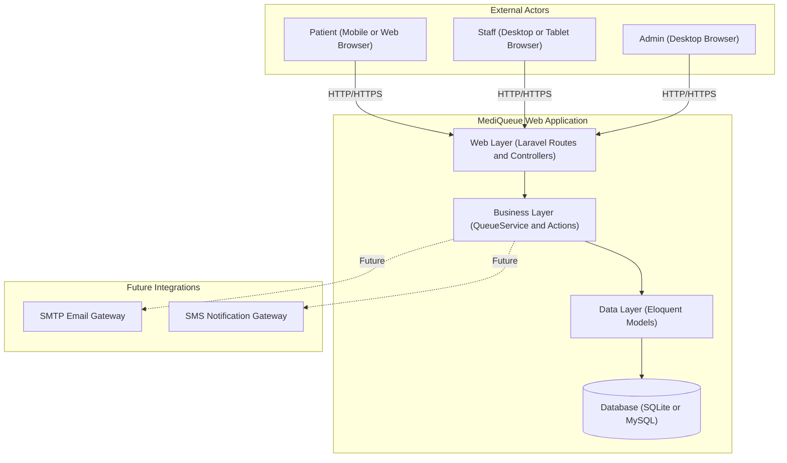
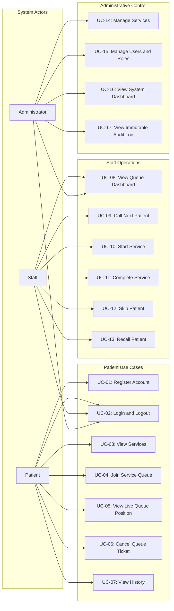
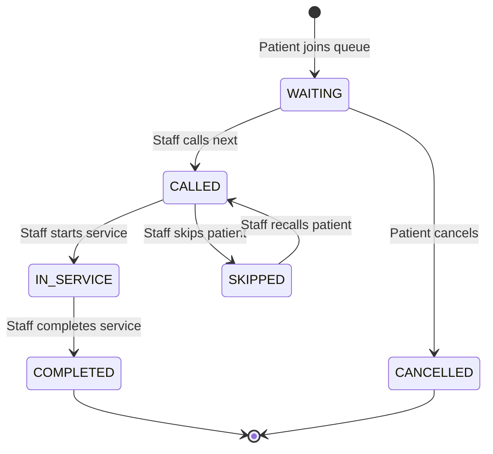
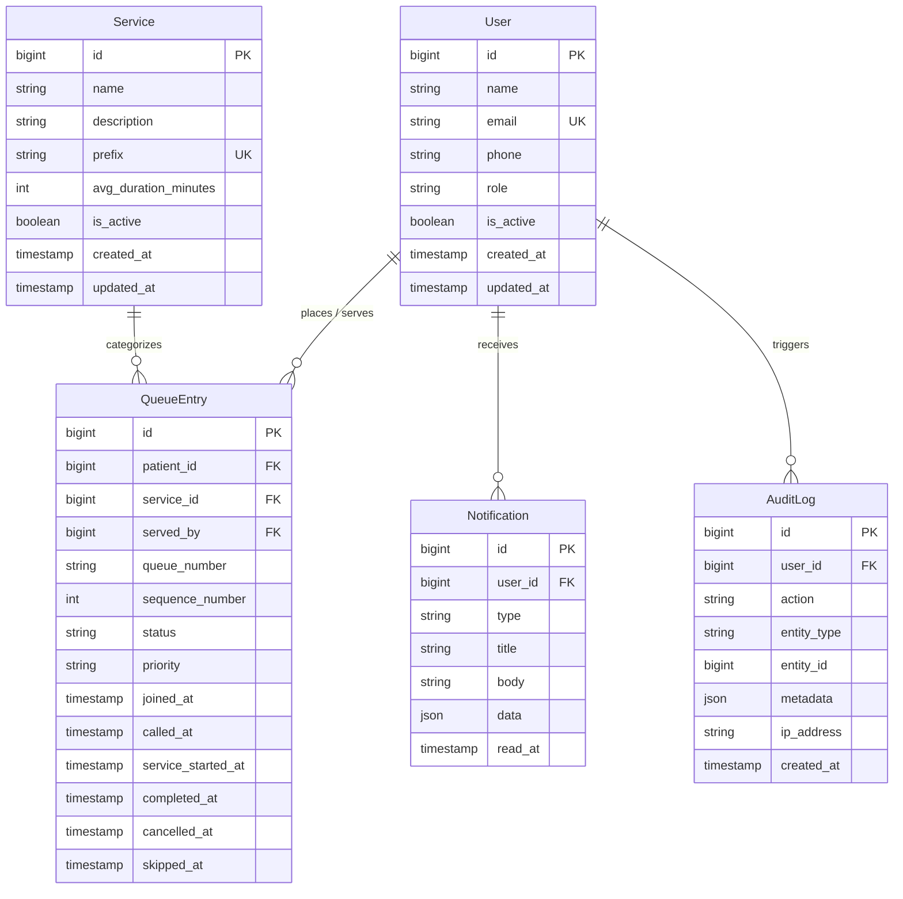
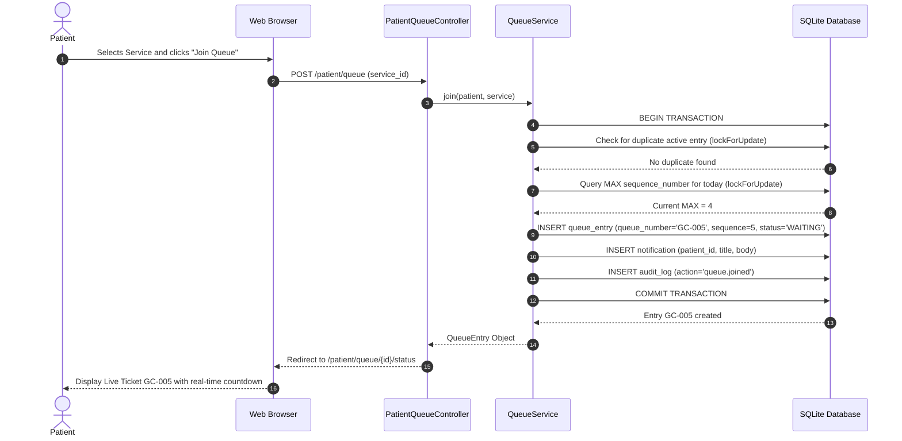
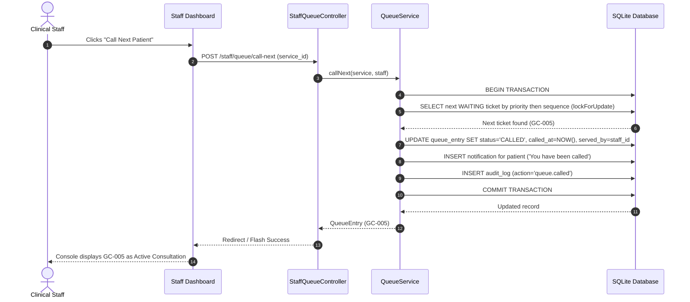
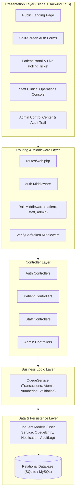

# MediQueue — System Analysis & Design

**Document ID**: SAD-001  
**Version**: 1.1  
**Date**: 2026-08-14  

---

## 1. System Context

MediQueue operates as a standalone web application within a clinic's local/cloud network. It interfaces with:

- **Web Browser (Patient)**: Mobile and desktop HTTP clients
- **Web Browser (Staff)**: Desktop and tablet HTTP clients
- **Web Browser (Admin)**: Desktop HTTP clients
- **Database**: Relational store (SQLite / MySQL)

---

## 2. Use Case Diagram

---

## 3. Queue State Machine

### Valid Transitions Table

| From State | To State | Trigger Actor | Action Event |
|---|---|---|---|
| `WAITING` | `CALLED` | Staff | Call Next button |
| `WAITING` | `CANCELLED` | Patient / Admin | Cancel ticket |
| `CALLED` | `IN_SERVICE` | Staff | Start Service button |
| `CALLED` | `SKIPPED` | Staff | Skip button (patient not present) |
| `SKIPPED` | `CALLED` | Staff | Recall button |
| `IN_SERVICE` | `COMPLETED` | Staff | Complete Service button |

**Invalid Transitions (Enforced by `QueueService`):**
- `COMPLETED` cannot transition to any other status (terminal state).
- `CANCELLED` cannot transition to any other status (terminal state).
- `IN_SERVICE` cannot transition directly to `WAITING` or `CANCELLED`.
- `COMPLETED` cannot transition to `WAITING`.

---

## 4. Entity-Relationship Diagram (ERD)

---

## 5. Sequence Diagram: Patient Joins Queue

---

## 6. Sequence Diagram: Staff Calls Next Patient

---

## 7. Layered Architecture Overview

