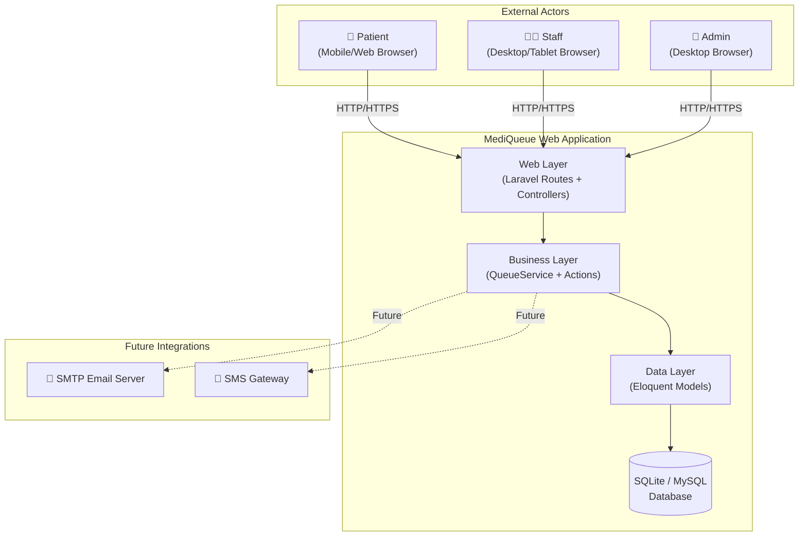
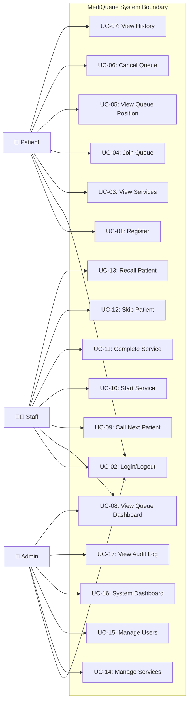
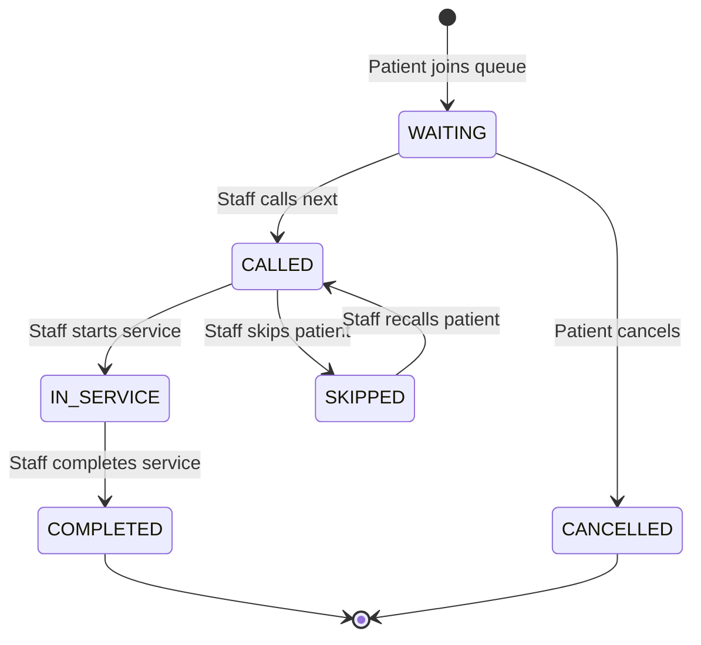
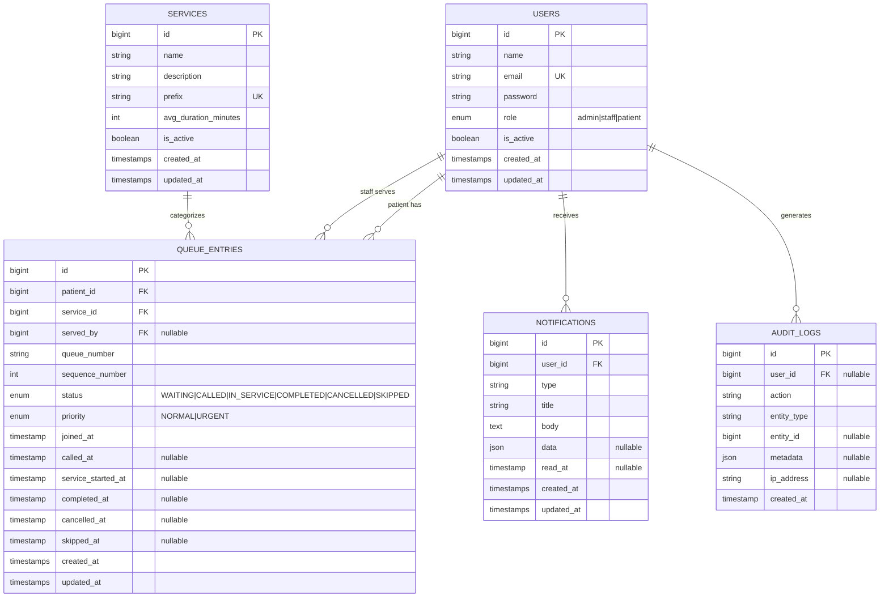
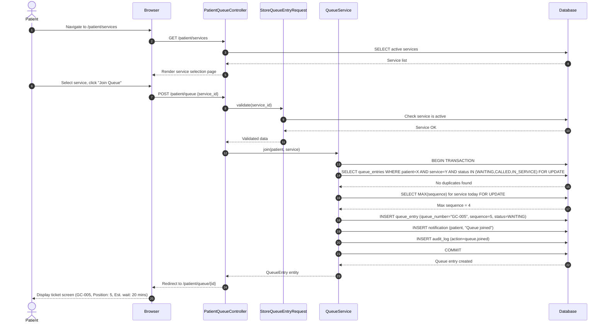
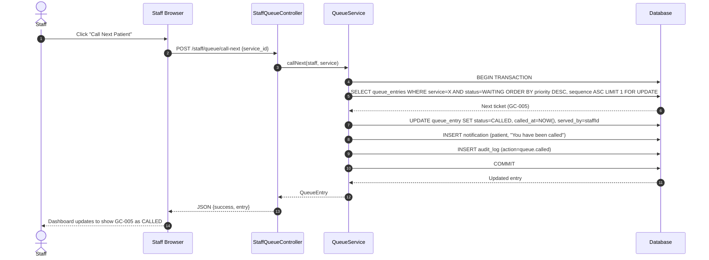

# MediQueue — System Analysis & Design

**Document ID**: SAD-001  
**Version**: 1.0  
**Date**: 2026-08-14  

---

## 1. System Context

MediQueue operates as a standalone web application within a clinic's local/cloud network. It interfaces with:

- **Web Browser (Patient)**: Mobile/desktop HTTP clients
- **Web Browser (Staff)**: Desktop/tablet HTTP clients
- **Web Browser (Admin)**: Desktop HTTP clients
- **SMTP Server** (future): Email notification delivery
- **Database**: Relational store (SQLite/MySQL)

---

## 2. Use Case Diagram

---

## 3. Queue State Machine

### Valid Transitions Table

| From | To | Actor | Trigger |
|---|---|---|---|
| WAITING | CALLED | Staff | "Call Next" action |
| WAITING | CANCELLED | Patient / Staff | Patient cancels or reception overrides |
| CALLED | IN_SERVICE | Staff | "Start Service" action |
| CALLED | SKIPPED | Staff | "Skip" action (no response) |
| SKIPPED | CALLED | Staff | "Recall" action |
| IN_SERVICE | COMPLETED | Staff | "Complete" action |

**Invalid Transitions** (backend enforced):
- COMPLETED → any (terminal state)
- CANCELLED → any (terminal state)  
- IN_SERVICE → WAITING/CANCELLED
- COMPLETED → WAITING

---

## 4. Entity-Relationship Diagram

---

## 5. Sequence Diagram: Patient Joins Queue

---

## 6. Sequence Diagram: Staff Calls Next Patient

---

## 7. Application Architecture

```mermaid
graph TB
    subgraph Routes["routes/web.php"]
        R1["Public Routes\n/ (landing)"]
        R2["Auth Routes\n/login /register"]
        R3["Patient Routes\n/patient/*"]
        R4["Staff Routes\n/staff/*"]
        R5["Admin Routes\n/admin/*"]
        R6["API Routes\n/api/* (polling)"]
    end

    subgraph Middleware["Middleware Stack"]
        M1["Auth (authenticate)"]
        M2["RoleMiddleware\n(patient|staff|admin)"]
        M3["CSRF Protection"]
    end

    subgraph Controllers["Controllers (app/Http/Controllers)"]
        C1["Auth/* Controllers"]
        C2["Patient/DashboardController\nPatient/QueueController"]
        C3["Staff/DashboardController\nStaff/QueueController"]
        C4["Admin/DashboardController\nAdmin/ServiceController\nAdmin/UserController\nAdmin/AuditController"]
        C5["Api/QueueStatusController"]
    end

    subgraph Services["Services (app/Services)"]
        S1["QueueService\n- join()\n- callNext()\n- startService()\n- complete()\n- skip()\n- recall()\n- cancel()"]
        S2["NotificationService\n- notify()"]
        S3["AuditService\n- record()"]
    end

    subgraph Models["Eloquent Models (app/Models)"]
        MOD1["User"]
        MOD2["Service"]
        MOD3["QueueEntry"]
        MOD4["Notification"]
        MOD5["AuditLog"]
    end

    Routes --> Middleware
    Middleware --> Controllers
    Controllers --> Services
    Services --> Models
```

